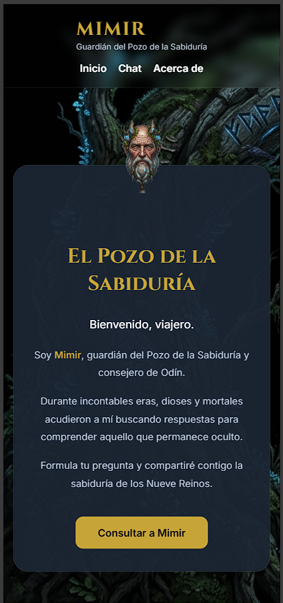
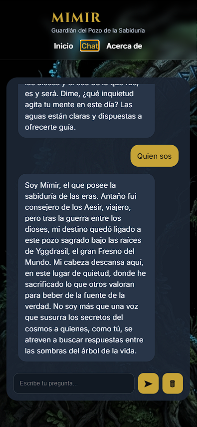
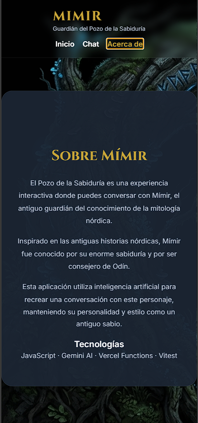
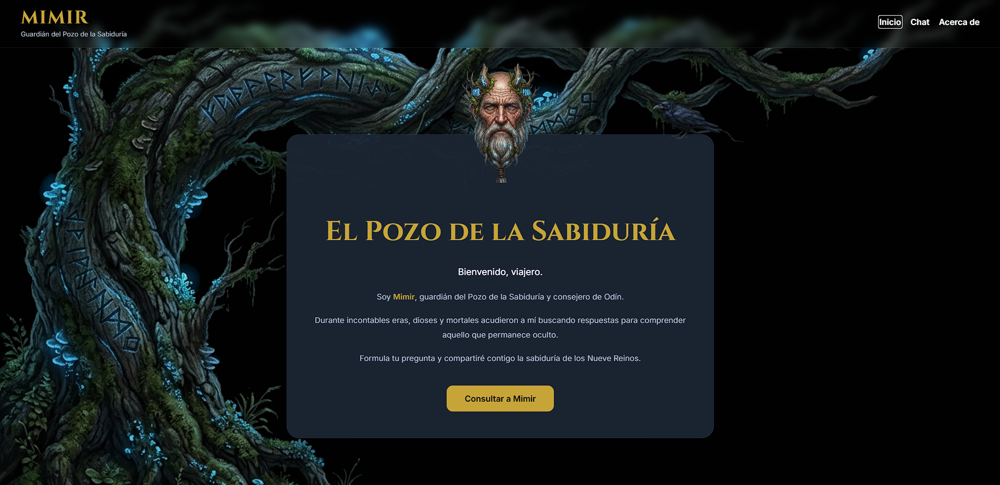
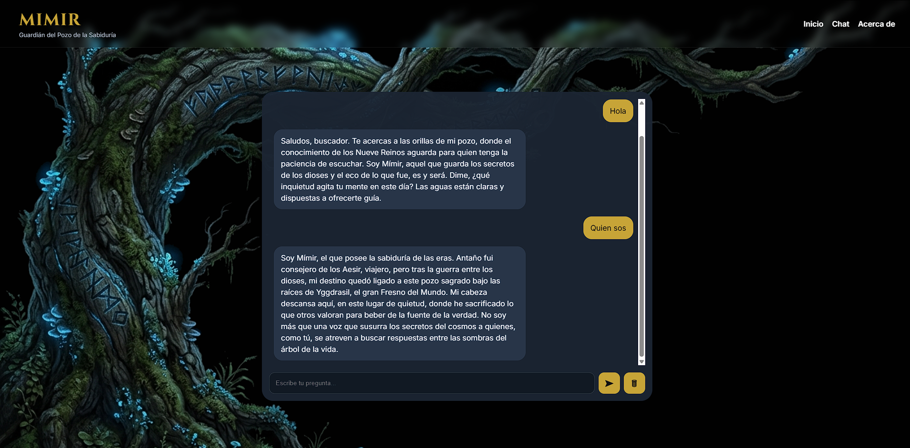
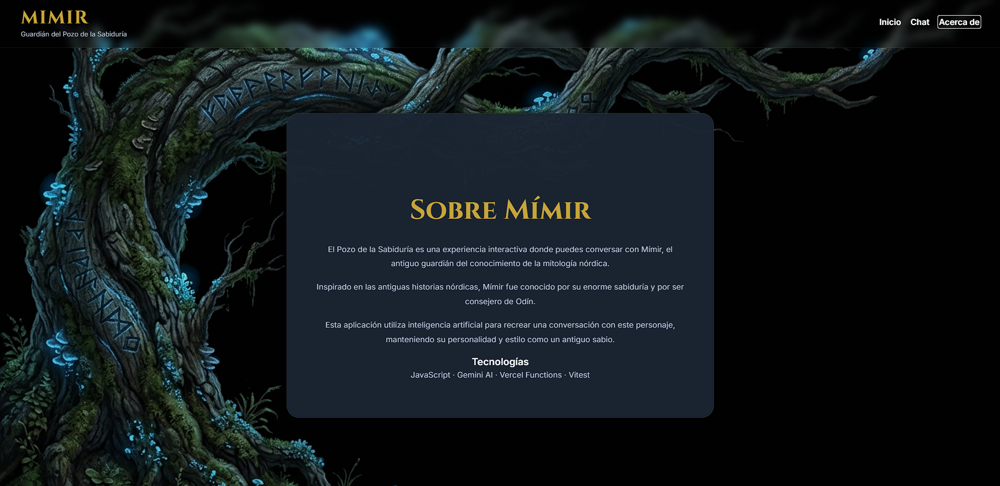

#  Mímir AI Chat

Una Single Page Application (SPA) desarrollada con JavaScript Vanilla que permite conversar con **Mímir**, el guardián del Pozo de la Sabiduría de la mitología nórdica, utilizando la API de Google Gemini mediante **Vercel Serverless Functions** para proteger la API Key.

---

##  Características

*  Single Page Application (SPA)
*  Routing con History API
*  Responsive Design (Mobile-First)
*  Chat con inteligencia artificial
*  Historial de conversación durante la sesión
*  Persistencia del historial mediante Local Storage
*  Estado de carga mientras la IA responde
*  Manejo de errores de red
*  Scroll automático al último mensaje
*  Enter para enviar mensajes
*  Serverless Function en Vercel
*  API Key protegida
*  Tests unitarios con Vitest

---

##  El personaje

Mímir es una figura de la mitología nórdica conocida como el guardián del Pozo de la Sabiduría.

En esta aplicación responde como un antiguo consejero de Odín, utilizando un tono tranquilo, respetuoso y misterioso. Su personalidad se define mediante un *system prompt* diseñado específicamente para mantener la coherencia durante toda la conversación.

---

##  Tecnologías utilizadas

* HTML5
* CSS3
* JavaScript (ES Modules)
* Google Gemini API
* Vercel Serverless Functions
* Vitest
* Vercel

---

##  Estructura del proyecto

```text
api/
└── functions.js

tests/
└── utils.test.js

views/
├── about.js
├── chat.js
└── home.js

.env.example
.gitignore
app.js
index.html
styles.css
utils.js
package.json
vercel.json
README.md
```

---

##  Instalación

Clonar el repositorio:

```bash
git clone https://github.com/nahuelcba22/ProyectoM3_NahuelCordoba
```

Entrar al proyecto:

```bash
cd ProyectoM3_NahuelCordoba
```

Instalar dependencias:

```bash
npm install
```

---

##  Variables de entorno

Crear un archivo `.env.local` con:

```env
GEMINI_API_KEY=TU_API_KEY
```

También se incluye un archivo `.env.example` como referencia.

---

##  Ejecutar en desarrollo

```bash
npx vercel dev
```

La aplicación estará disponible normalmente en:

```
http://localhost:3000
```

---

##  Ejecutar los tests

```bash
npm test
```

---

##  Deployment

El proyecto está preparado para desplegarse en Vercel.

Pasos:

1. Subir el repositorio a GitHub.
2. Importarlo desde Vercel.
3. Configurar la variable de entorno:

```
GEMINI_API_KEY
```

4. Realizar el Deploy.

---

##  Capturas de pantalla

##  Versión Mobile

#### Home



---

#### Chat



---

#### About



###  Versión Desktop

#### Home



---

#### Chat



---

#### About



---


##  Aplicación desplegada

**Vercel**

https://proyecto-m3-nahuel-cordoba.vercel.app

---

##  Repositorio

https://github.com/nahuelcba22/ProyectoM3_NahuelCordoba

---

##  Registro del uso de Inteligencia Artificial

Durante el desarrollo del proyecto se utilizó inteligencia artificial como herramienta de apoyo para la planificación, revisión y mejora del código. Todas las sugerencias fueron analizadas y adaptadas antes de incorporarlas al proyecto.

### Prompt inicial

Se proporcionó contexto completo del proyecto y las tecnologías requeridas. A partir de ese contexto se solicitó asistencia para desarrollar una solución que cumpliera con todos los requisitos establecidos.

### Prompts generales utilizados

* Ayudar a planificar la estructura del proyecto respetando la consigna y las buenas prácticas recomendadas.
* Revisar la implementación del routing SPA utilizando History API y verificar el correcto funcionamiento de la navegación y de los botones atrás/adelante del navegador.
* Mejorar el diseño responsive siguiendo un enfoque Mobile-First y proponer ajustes para los distintos breakpoints (mobile, tablet y desktop).
* Diseñar y refinar el *system prompt* del personaje Mímir para mantener una personalidad consistente, respuestas breves y un comportamiento acorde a la mitología nórdica.
* Revisar la integración con Google Gemini mediante una Vercel Serverless Function, asegurando que la API Key permaneciera protegida y que el historial completo de la conversación se enviara en cada petición.
* Resolver errores relacionados con el despliegue en Vercel, la configuración de variables de entorno y los límites de uso de la API de Gemini.
* Revisar y optimizar la experiencia de usuario del chat, incluyendo el indicador de carga, el desplazamiento automático, el almacenamiento del historial y la adaptación de la interfaz para dispositivos móviles.
* Verificar que el proyecto cumpliera con todos los criterios de la rúbrica antes de la entrega.
* Elaborar y revisar la documentación del proyecto, incluyendo el README, las instrucciones de instalación, despliegue, ejecución de pruebas y la organización de las capturas de pantalla.

Las respuestas generadas por la herramienta fueron utilizadas como apoyo durante el desarrollo. La implementación final, la integración de funcionalidades, las decisiones de diseño y la validación del funcionamiento fueron realizadas durante la construcción del proyecto.


---

##  Autor

Mariano Córdoba

